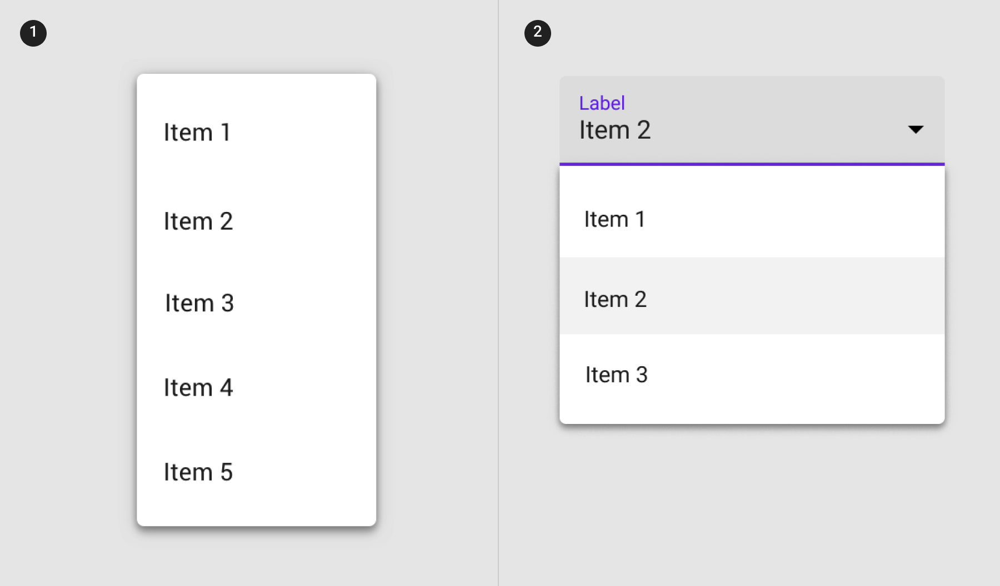
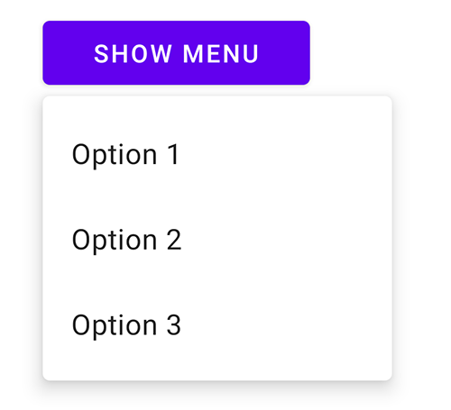
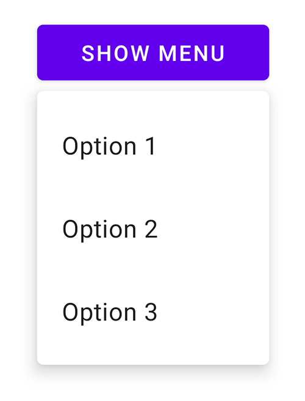
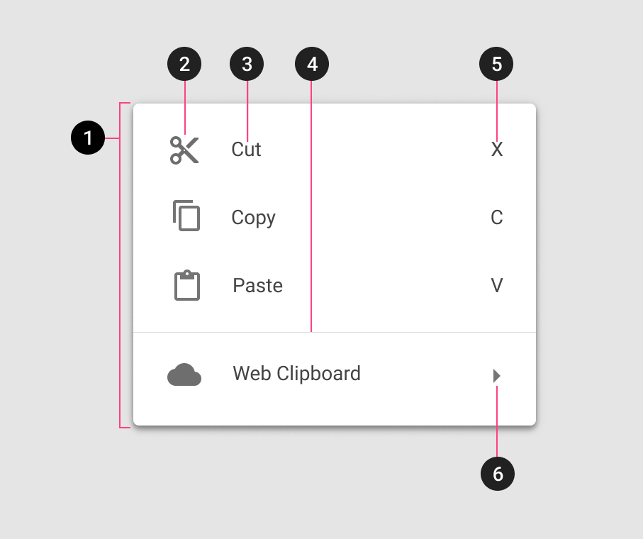
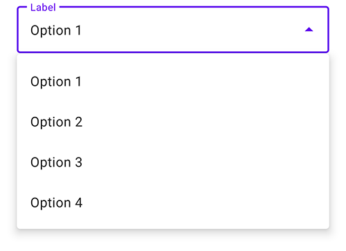
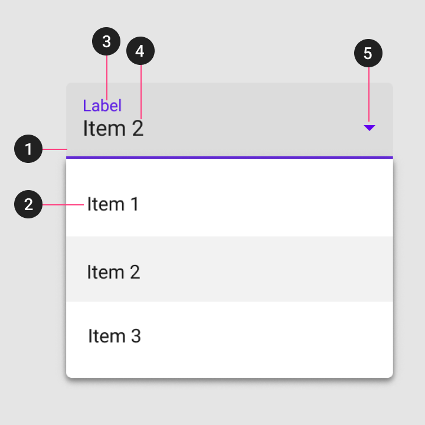
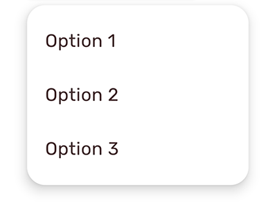

<!--docs:
title: "Menus"
layout: detail
section: components
excerpt: "Menus display a list of choices on temporary surfaces."
iconId: menu
path: /catalog/menus/
-->

# Menus

[Menus](https://material.io/components/menus) display a list of choices on
temporary surfaces.


**Contents**

*   [Using menus](#using-menus)
*   [Dropdown menus](#dropdown-menus)
*   [Exposed dropdown menus](#exposed-dropdown-menus)
*   [Theming](#theming-menus)

## Using menus

A menu displays a list of choices on a temporary surface. They appear when users
interact with a button, action, or other control.

Before you can use Material menus, you need to add a dependency to the Material
Components for Android library. For more information, go to the
[Getting started](https://github.com/material-components/material-components-android/tree/master/docs/getting-started.md)
page.

A typical menu resource looks like this:

```xml
<?xml version="1.0" encoding="utf-8"?>
<menu xmlns:android="http://schemas.android.com/apk/res/android">
    <item android:id="@+id/option_1"
          android:title="@string/option_1" />
    <item android:id="@+id/option_2"
          android:title="@string/option_2" />
    <item android:id="@+id/option_3"
          android:title="@string/option_3" />
</menu>
```

A typical exposed dropdown menu looks like this:

```xml
<com.google.android.material.textfield.TextInputLayout
    android:id="@+id/menu"
    style="@style/Widget.MaterialComponents.TextInputLayout.FilledBox.ExposedDropdownMenu"
    android:layout_width="match_parent"
    android:layout_height="wrap_content"
    android:hint="@string/label">

    <AutoCompleteTextView
        android:layout_width="match_parent"
        android:layout_height="wrap_content"
        android:inputType="none"
    />

</com.google.android.material.textfield.TextInputLayout>
```

See the [dropdown menus](#dropdown-menus) and
[exposed dropdown menus](#exposed-dropdown-menus) sections for detailed usage
information.

### Making menus accessible

Menus are readable by most screen readers, such as TalkBack. Text rendered in
menus is automatically provided to accessibility services. Additional content
labels are usually unnecessary.

Android's exposed dropdown menu component APIs support both label text and
helper text for informing the user as to what information is requested for a
menu. While optional, their use is strongly encouraged. For more information
about this component's accessibility, check out
[the text field's a11y section](TextField.md#making-text-fields-accessible).

### Types

Menus allow users to make a selection from multiple options. They are less
prominent and take up less space than selection controls, such as a set of radio
buttons.

There are two types of menus: 1\. [Dropdown menus](#dropdown-menus) (overflow,
context, popup, and list popup window menus), 2\.
[Exposed dropdown menus](#exposed-dropdown-menus).



## Dropdown menus

Dropdown menus display a list of options, triggered by an icon, button, or
action. Their placement varies based on the element that opens them.

### Dropdown menu examples

API and source code:

*   `Menu`
    *   [Class definition](https://developer.android.com/reference/android/view/Menu)
*   `MenuInflater`
    *   [Class definition](https://developer.android.com/reference/android/view/MenuInflater)
*   `ContextMenu`
    *   [Class definition](https://developer.android.com/reference/android/view/ContextMenu)
*   `PopupMenu`
    *   [Class definition](https://developer.android.com/reference/android/widget/PopupMenu)
*   `ListPopupWindow`
    *   [Class definition](https://developer.android.com/reference/android/widget/ListPopupWindow)

#### Overflow menus

The following example shows an overflow menu.


In code:

```kt
override fun onCreateOptionsMenu(menu: Menu): Boolean {
    val inflater: MenuInflater = menuInflater
    inflater.inflate(R.menu.overflow_menu, menu)
    return true
}
```

In `res/menu/overflow_menu.xml`:

```xml
<menu xmlns:android="http://schemas.android.com/apk/res/android">
    <item android:id="@+id/option_1"
          android:title="@string/option_1" />
    <item android:id="@+id/option_2"
          android:title="@string/option_2" />
    <item android:id="@+id/option_3"
          android:title="@string/option_3" />
</menu>
```

#### Context menus

The following example shows a context menu that appears when a `TextView` is
long pressed.


In code:

```kt
override fun onCreate(savedInstanceState: Bundle?) {
    ...
    val contextMenuTextView = view.findViewById<TextView>(R.id.context_menu_tv)
    // Register context menu for TextView
    registerForContextMenu(contextMenuTextView)
}

override fun onCreateContextMenu(menu: ContextMenu, v: View, menuInfo: ContextMenu.ContextMenuInfo?) {
    val contextMenuTextView = v as TextView
    val context = context
    // Add menu items via menu.add
    menu.add(R.string.option_1)
        .setOnMenuItemClickListener { item: MenuItem? ->
            // Respond to item click.
      }
    menu.add(R.string.option_2)
        .setOnMenuItemClickListener { item: MenuItem? ->
            // Respond to item click.
      }
}

override fun onContextMenuClosed(menu: Menu) {
    // Respond to context menu being closed.
}
```

In the layout:

```xml
<TextView
    android:id="@+id/context_menu_tv"
    android:layout_width="match_parent"
    android:layout_height="wrap_content"
    android:padding="16dp"
    android:text="@string/menu_context_menu_description"/>
```

Alternatively, you can inflate a context menu in `onCreateContextMenu`
(similarly to the overflow menu):

```kt
override fun onCreateContextMenu(menu: ContextMenu, v: View, menuInfo: ContextMenu.ContextMenuInfo?) {
  super.onCreateContextMenu(menu, v, menuInfo)
  val inflater: MenuInflater = menuInflater
  inflater.inflate(R.menu.context_menu, menu)
}

// Then, to handle clicks:
override fun onContextItemSelected(item: MenuItem): Boolean {
  val info = item.menuInfo as AdapterView.AdapterContextMenuInfo
  return when (item.itemId) {
    R.id.option_1 -> {
      // Respond to context menu item 1 click.
      true
    }
    R.id.option_2 -> {
      // Respond to context menu item 2 click.
      true
    }
    else -> super.onContextItemSelected(item)
  }
}
```

with a `res/menu/context_menu.xml`:

```xml
<menu xmlns:android="http://schemas.android.com/apk/res/android">
    <item android:id="@+id/option_1"
          android:title="@string/option_1" />
    <item android:id="@+id/option_2"
          android:title="@string/option_2" />
</menu>
```

#### Popup menus

The following example shows a popup menu when a button is clicked.



In code:

```kt
override fun onCreate(savedInstanceState: Bundle?) {
    ...
    val button = view.findViewById<Button>(R.id.menu_button)
    button.setOnClickListener { v: View ->
        showMenu(v, R.menu.popup_menu)
    }
}

private fun showMenu(v: View, @MenuRes menuRes: Int) {
    val popup = PopupMenu(context!!, v)
    popup.menuInflater.inflate(menuRes, popup.menu)

    popup.setOnMenuItemClickListener { menuItem: MenuItem ->
        // Respond to menu item click.
    }
    popup.setOnDismissListener {
        // Respond to popup being dismissed.
    }
    // Show the popup menu.
    popup.show()
}
```

In the layout:

```xml
<Button
    android:id="@+id/menu_button"
    android:layout_width="match_parent"
    android:layout_height="wrap_content"
    android:text="@string/show_menu"/>
```

In `res/menu/popup_menu.xml`:

```xml
<menu xmlns:android="http://schemas.android.com/apk/res/android">
    <item android:id="@+id/option_1"
          android:title="@string/option_1" />
    <item android:id="@+id/option_2"
          android:title="@string/option_2" />
    <item android:id="@+id/option_3"
          android:title="@string/option_3" />
</menu>
```

##### Adding icons on popup menus

Currently, there is no public API to add icons on popup menus. The following
workaround is for API 21+, and uses library-only APIs, and is not guaranteed to
work in future versions.

The following example shows a popup menu with icons.


In code:

```kt
//In the showMenu function from the previous example:
private fun showMenu(v: View, @MenuRes menuRes: Int) {
    val popup = PopupMenu(context!!, v)
    popup.menuInflater.inflate(menuRes, popup.menu)
    ...
    if (popup.menu is MenuBuilder) {
        val menuBuilder = popup.menu as MenuBuilder
        menuBuilder.setOptionalIconsVisible(true)
        for (item in menuBuilder.visibleItems) {
            val iconMarginPx =
                TypedValue.applyDimension(
                    TypedValue.COMPLEX_UNIT_DIP, ICON_MARGIN.toFloat(), resources.displayMetrics)
                .toInt()
            if (item.icon != null) {
              if (Build.VERSION.SDK_INT > Build.VERSION_CODES.LOLLIPOP) {
                  item.icon = InsetDrawable(item.icon, iconMarginPx, 0, iconMarginPx,0)
              } else {
                  item.icon =
                      object : InsetDrawable(item.icon, iconMarginPx, 0, iconMarginPx, 0) {
                          override fun getIntrinsicWidth(): Int {
                              return intrinsicHeight + iconMarginPx + iconMarginPx
                      }
                }
              }
          }
      }
    }
    ...
    popup.show()
}
```

In `res/menu/popup_menu.xml`:

```xml
<menu xmlns:android="http://schemas.android.com/apk/res/android">
    <item android:id="@+id/option_1"
          android:icon="@drawable/ic_3d_rotation_24dp"
          android:title="@string/option_1" />
    <item android:id="@+id/option_2"
          android:icon="@drawable/ic_accelerator_24dp"
          android:title="@string/option_2" />
    <item android:id="@+id/option_3"
          android:icon="@drawable/ic_favorite_24dp"
          android:title="@string/option_3" />
</menu>
```

#### List popup window menus

The following example shows a list popup window menu when a button is clicked.



In code:

```kt
val listPopupWindowButton = view.findViewById<Button>(R.id.list_popup_button)
val listPopupWindow = ListPopupWindow(context!!, null, R.attr.listPopupWindowStyle)

// Set button as the list popup's anchor
listPopupWindow.anchorView = listPopupWindowButton

// Set list popup's content
val items = listOf("Option 1", "Option 2", "Option 3")
val adapter = ArrayAdapter(requireContext(), R.layout.list_popup_window_item, items)
listPopupWindow.setAdapter(adapter)

// Set list popup's item click listener
listPopupWindow.setOnItemClickListener { parent: AdapterView<*>?, view: View?, position: Int, id: Long ->
  // Respond to list popup window item click.

  // Dismiss popup.
  listPopupWindow.dismiss()
}

// Show list popup window on button click.
listPopupWindowButton.setOnClickListener { v: View? -> listPopupWindow.show() }
```

In the layout:

```xml
<Button
    android:id="@+id/list_popup_button"
    android:layout_width="match_parent"
    android:layout_height="wrap_content"
    android:text="@string/show_menu"/>
```

In the item layout `res/layout/list_popup_window_item.xml`:

```xml
<TextView
    xmlns:android="http://schemas.android.com/apk/res/android"
    android:layout_width="match_parent"
    android:layout_height="wrap_content"
    android:padding="16dp"
    android:ellipsize="end"
    android:maxLines="1"
    android:textAppearance="?attr/textAppearanceSubtitle1"
/>
```

### Anatomy and key properties

The following are menu anatomy diagrams showing all possible elements:



1.  Container
1.  Leading icon (optional)
1.  Text
1.  Divider (optional)
1.  Command (not supported on Android)
1.  Cascading menu indicator (optional)

#### Container attributes

Element        | Attribute                     | Related method(s) | Default value
-------------- | ----------------------------- | ----------------- | -------------
**Background** | `android:popupMenuBackground` | N/A               | `?attr/popupMenuBackground`
**Color**      | N/A                           | N/A               | `?attr/colorSurface`
**Elevation**  | `android:popupElevation`      | N/A               | `8dp`

#### Text attributes

Element        | Attribute                                                                     | Related method(s)                                                  | Default value
-------------- | ----------------------------------------------------------------------------- | ------------------------------------------------------------------ | -------------
**Text label** | `android:title`                                                               | `getMenu().add`<br/>`getMenu().addSubMenu`<br/>`getMenu().getItem` | N/A
**Typography** | `?attr/textAppearanceLargePopupMenu`<br/>`?attr/textAppearanceSmallPopupMenu` | N/A                                                                | `?attr/textAppearanceSubtitle1`

#### Styles

Element                     | **Theme attribute**              | **Default value**
--------------------------- | -------------------------------- | -----------------
**Popup menus**             | `?attr/popupMenuStyle`           | `@style/Widget.MaterialComponents.PopupMenu`
**List popup window style** | `?attr/listPopupWindowStyle`     | `@style/Widget.MaterialComponents.PopupMenu.ListPopupWindow`
**Context menus**           | `?android:contextPopupMenuStyle` | `@style/Widget.MaterialComponents.PopupMenu.ContextMenu`
**Overflow menus**          | `?attr/actionOverflowMenuStyle`  | `@style/Widget.MaterialComponents.PopupMenu.Overflow`

See the full list of
[styles](https://github.com/material-components/material-components-android/tree/master/lib/java/com/google/android/material/menu/res/values/styles.xml)
and
[attrs](https://github.com/material-components/material-components-android/tree/master/lib/java/com/google/android/material/menu/res/values/attrs.xml).

## Exposed dropdown menus

Exposed dropdown menus display the currently selected menu item above the list
of options. Some variations can accept user-entered input.

_**Note:** The exposed dropdown menu is implemented through the
`TextInputLayout`. For detailed information on
[Material text fields](https://material.io/design/components/text-fields.html)
and their usage, see the [TextInputLayout documentation](TextField.md)._

### Exposed dropdown menu example

API and source code:

*   `TextInputLayout`
    *   [Class definition](https://developer.android.com/reference/com/google/android/material/textfield/TextInputLayout)
    *   [Class source](https://github.com/material-components/material-components-android/tree/master/lib/java/com/google/android/material/textfield/TextInputLayout.java)
*   `AutoCompleteTextView`
    *   [Class definition](https://developer.android.com/reference/android/widget/AutoCompleteTextView)
*   `MaterialAutoCompleteTextView`
    *   [Class definition](https://developer.android.com/reference/com/google/android/material/textfield/MaterialAutoCompleteTextView)
    *   [Class source](https://github.com/material-components/material-components-android/tree/master/lib/java/com/google/android/material/textfield/MaterialAutoCompleteTextView.java)

_**Note:** `MaterialComponentsViewInflater` auto-inflates
`<AutoCompleteTextView>` to
`<com.google.android.material.textfield.MaterialAutoCompleteTextView>` when
using a non-Bridge `Theme.MaterialComponents.*` theme._

The following is an example of a filled exposed dropdown menu:


In the layout:

```xml
<com.google.android.material.textfield.TextInputLayout
    android:id="@+id/menu"
    style="@style/Widget.MaterialComponents.TextInputLayout.FilledBox.ExposedDropdownMenu"
    android:layout_width="match_parent"
    android:layout_height="wrap_content"
    android:hint="@string/label">

    <AutoCompleteTextView
        android:layout_width="match_parent"
        android:layout_height="wrap_content"
        android:inputType="none"
    />

</com.google.android.material.textfield.TextInputLayout>
```

In code:

```kt
val items = listOf("Option 1", "Option 2", "Option 3", "Option 4")
val adapter = ArrayAdapter(requireContext(), R.layout.list_item, items)
(textField.editText as? AutoCompleteTextView)?.setAdapter(adapter)
```

In the item layout (`list_item.xml`):

```xml
<TextView
    xmlns:android="http://schemas.android.com/apk/res/android"
    android:layout_width="match_parent"
    android:layout_height="wrap_content"
    android:padding="16dp"
    android:ellipsize="end"
    android:maxLines="1"
    android:textAppearance="?attr/textAppearanceSubtitle1"
/>
```

To have an outlined variation of the exposed dropdown menu, set the `style` to
`@style/Widget.MaterialComponents.TextInputLayout.OutlinedBox.ExposedDropdownMenu`:



#### Non editable variation

Disable the user input in the `AutoCompleteTextView` to have a non editable
variation of the menu by setting `android:inputType="none"` on the
`AutoCompleteTextView`.

#### Setting a default value

In order to have a pre-selected value displayed, you can call
`setText(CharSequence text, boolean filter)` on the `AutoCompleteTextView` with
the filter set to `false`.

### Anatomy and key properties

The exposed dropdown menu is made of an `AutoCompleteTextView` within a
`TextInputLayout` that has a dropdown menu displayed below it.



1.  Container
1.  Text
1.  Label
1.  Selection/Input text
1.  Trailing icon

#### `TextInputLayout` attributes (container, label, trailing icon)

To see all attributes that apply to the `TextInputLayout`, see the
[TextInputLayout documentation](TextField.md).

#### `AutoCompleteTextView` attributes (input text, dropdown menu)

Element                               | Attribute                                                           | Related method(s)                                            | Default value
------------------------------------- | ------------------------------------------------------------------- | ------------------------------------------------------------ | -------------
**Input text**                        | `android:text`                                                      | `setText`<br/>`getText`                                      | `@null`
**Typography**                        | `android:textAppearance`                                            | `setTextAppearance`                                          | `?attr/textAppearanceSubtitle1`
**Input accepted**                    | `android:inputType`                                                 | `N/A`                                                        | framework's default
**Input text color**                  | `android:textColor`                                                 | `setTextColor`<br/>`getTextColors`<br/>`getCurrentTextColor` | `?android:textColorPrimary`
**Cursor color**                      | N/A (color comes from the theme attr `?attr/colorControlActivated`) | N/A                                                          | `?attr/colorPrimary`
**Dropdown menu<br/>container color** | N/A                                                                 | N/A                                                          | `?attr/colorSurface`
**Dropdown menu elevation**           | `android:popupElevation`                                            | N/A                                                          | `8dp`

#### Styles

Element            | Style
------------------ | -----
**Filled style**   | `Widget.MaterialComponents.TextInputLayout.FilledBox.ExposedDropdownMenu`
**Outlined style** | `Widget.MaterialComponents.TextInputLayout.OutlinedBox.ExposedDropdownMenu`
**Filled dense**   | `Widget.MaterialComponents.TextInputLayout.FilledBox.Dense.ExposedDropdownMenu`
**Outlined dense** | `Widget.MaterialComponents.TextInputLayout.OutlinedBox.Dense.ExposedDropdownMenu`

Default style theme attribute: `?attr/textInputStyle`

See the full list of
[styles](https://github.com/material-components/material-components-android/tree/master/lib/java/com/google/android/material/textfield/res/values/styles.xml)
and
[attrs](https://github.com/material-components/material-components-android/tree/master/lib/java/com/google/android/material/textfield/res/values/attrs.xml).

## Theming menus

Menus drawers support
[Material Theming](https://material.io/components/text-fields/#theming) and can
be customized in terms of color, typography and shape.

### Menu theming examples

Popup, overflow, and list popup window menus support
[Material Theming](https://material.io/components/chips/#theming) and can be
customized in terms of typography.

API and source code:

*   `Menu`
    *   [Class definition](https://developer.android.com/reference/android/view/Menu)
*   `MenuInflater`
    *   [Class definition](https://developer.android.com/reference/android/view/MenuInflater)
*   `ContextMenu`
    *   [Class definition](https://developer.android.com/reference/android/view/ContextMenu)
*   `PopupMenu`
    *   [Class definition](https://developer.android.com/reference/android/widget/PopupMenu)
*   `ListPopupWindow`
    *   [Class definition](https://developer.android.com/reference/android/widget/ListPopupWindow)

The following example shows a menu with Material Theming.



### Implementing menu theming

Using default style theme attributes (affects all menus but does not affect
other components):

```xml
<style name="Theme.App" parent="Theme.MaterialComponents.*">
    ...
    <item name="textAppearanceLargePopupMenu">@style/TextAppearance.App.Subtitle1</item>
    <item name="textAppearanceSmallPopupMenu">@style/TextAppearance.App.Subtitle1</item>
    <item name="popupMenuBackground">@drawable/custom_popup_background</item>
</style>

<style name="TextAppearance.App.Subtitle1" parent="TextAppearance.MaterialComponents.Subtitle1">
    <item name="fontFamily">@font/rubik</item>
    <item name="android:fontFamily">@font/rubik</item>
    <item name="android:textColor">@color/shrine_pink_900</item>
</style>
```

In `res/drawable/custom_popup_background`:

```xml
<?xml version="1.0" encoding="UTF-8"?>
<shape xmlns:android="http://schemas.android.com/apk/res/android">
  <solid android:color="?attr/colorSurface"/>
  <corners
    android:radius="16dp"/>
  <padding
      android:bottom="8dp"
      android:top="8dp"/>
</shape>
```

Use a custom style instead of overriding `?attr/popupMenuBackground` if you want
to set a custom background for one type of menu:

```xml
<style name="Theme.App" parent="Theme.MaterialComponents.*">
    ...
    <item name="popupMenuStyle">@style/Widget.App.PopupMenu</item>
</style>

<style name="Widget.App.PopupMenu" parent="Widget.MaterialComponents.PopupMenu">
    <item name="android:popupBackground">@drawable/custom_popupmenu_background</item>
</style>
```

### Exposed dropdown menu theming example

Exposed dropdown menus support
[Material Theming](https://material.io/components/chips/#theming) and can be
customized in terms of color, typography, and shape.

_**Note:** The exposed dropdown menu is implemented through the
`TextInputLayout`. For detailed information on how
[Material text fields](https://material.io/design/components/text-fields.html)
work, see the [TextInputLayout documentation](TextField.md)._

API and source code:

*   `TextInputLayout`
    *   [Class definition](https://developer.android.com/reference/com/google/android/material/textfield/TextInputLayout)
    *   [Class source](https://github.com/material-components/material-components-android/tree/master/lib/java/com/google/android/material/textfield/TextInputLayout.java)
*   `AutoCompleteTextView`
    *   [Class definition](https://developer.android.com/reference/android/widget/AutoCompleteTextView)
*   `MaterialAutoCompleteTextView`
    *   [Class definition](https://developer.android.com/reference/com/google/android/material/textfield/MaterialAutoCompleteTextView)
    *   [Class source](https://github.com/material-components/material-components-android/tree/master/lib/java/com/google/android/material/textfield/MaterialAutoCompleteTextView.java)

The following example shows filled and outlined exposed dropdown menu types with
Material Theming.


### Implementing exposed dropdown menu theming

Using default style theme attributes, styles and theme overlays (themes all
menus but does not affect other components):

```xml
<style name="Theme.App" parent="Theme.MaterialComponents.*">
    ...
    <item name="textInputStyle">@style/Widget.App.ExposedDropdownMenu</item>
</style>

<style name="Widget.App.ExposedDropdownMenu" parent="Widget.MaterialComponents.TextInputLayout.*.ExposedDropdownMenu">
    <item name="materialThemeOverlay">@style/ThemeOverlay.App.ExposedDropdownMenu</item>
    <item name="shapeAppearance">@style/ShapeAppearance.App.SmallComponent</item>
    <item name="hintTextColor">?attr/colorOnSurface</item>
    <item name="endIconTint">?attr/colorOnSurface</item>
</style>

<style name="ThemeOverlay.App.ExposedDropdownMenu" parent="">
    <item name="colorPrimary">@color/shrine_pink_100</item>
    <item name="colorOnSurface">@color/shrine_pink_900</item>
    <item name="colorError">@color/shrine_red</item>
    <item name="textAppearanceSubtitle1">@style/TextAppearance.App.Subtitle1</item>
    <item name="textAppearanceCaption">@style/TextAppearance.App.Caption</item>
    <item name="autoCompleteTextViewStyle">@style/Widget.MaterialComponents.AutoCompleteTextView.*</item>
</style>

<style name="TextAppearance.App.Subtitle1" parent="TextAppearance.MaterialComponents.Subtitle1">
    <item name="fontFamily">@font/rubik</item>
    <item name="android:fontFamily">@font/rubik</item>
</style>

<style name="TextAppearance.App.Caption" parent="TextAppearance.MaterialComponents.Caption">
    <item name="fontFamily">@font/rubik</item>
    <item name="android:fontFamily">@font/rubik</item>
</style>

<style name="ShapeAppearance.App.SmallComponent" parent="ShapeAppearance.MaterialComponents.SmallComponent">
    <item name="cornerFamily">cut</item>
    <item name="cornerSize">4dp</item>
</style>
```

or using the style in the layout (affects only this menu):

```xml
<com.google.android.material.textfield.TextInputLayout
    ...
    style="@style/Widget.App.ExposedDropdownMenu">

    ...

</com.google.android.material.textfield.TextInputLayout>
```

_**Note:** When setting a `materialThemeOverlay` on a custom `TextInputLayout`
style, set `autoCompleteTextViewStyle` to either a
`@style/Widget.MaterialComponents.AutoCompleteTextView.*` style or to a custom one
that inherits from that.
<br/>
The `TextInputLayout.*.ExposedDropdownMenu` styles set `materialThemeOverlay` that overrides
`autoCompleteTextViewStyle` with the specific `AutoCompleteTextView` style needed. Therefore,
you don't need to specify a style tag on the `AutoCompleteTextView`._
